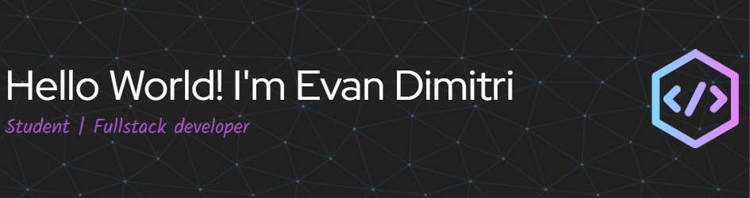

## Hello World! 👋

<!--  -->

### I'm Evan Dimitri Greatness Thaiputra

- 🔭 I'm currently working on SMK Kristen Immanuel
- 📚 I'm currently learning on web development
- 🔍 I'm currently search for team to make a project

##### Skills

                           

##### Connect with me

   
